# ⚡ GPU/System Performance Analytics Platform

> A production-style **Performance Monitoring & Bottleneck Detection System** — simulates GPU/CPU metrics, detects bottlenecks, runs anomaly detection, and delivers analyst-grade insights via an interactive dashboard.

[](https://python.org)
[](https://streamlit.io)
[](https://plotly.com)
[](https://sqlite.org)
[](LICENSE)

---

## 🖥️ Dashboard Preview

### Initial State — Ready to Analyse
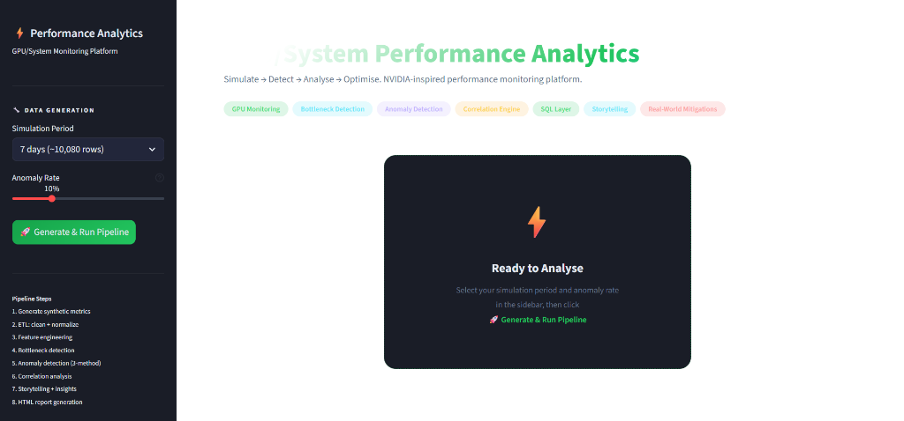

### System Overview — KPIs & Health Gauges
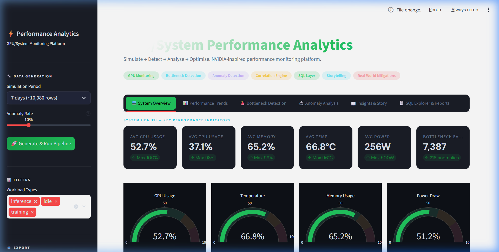

### Performance Trends — GPU/CPU Over Time
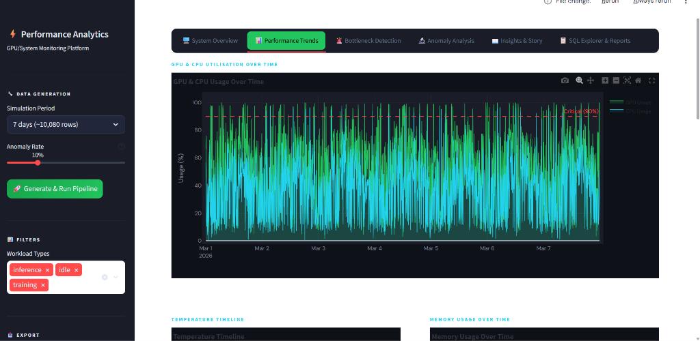

### Bottleneck Detection — Timeline & Severity
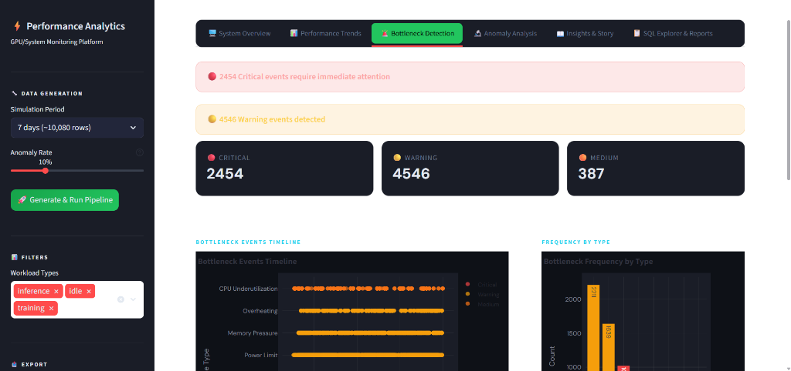

### Bottleneck Events — Detailed Analysis
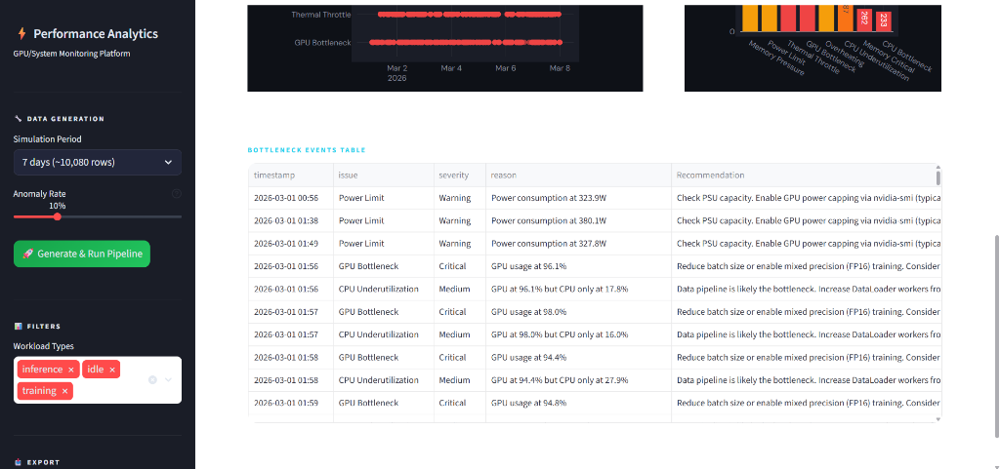

### Anomaly Analysis — Heatmap & Confidence Levels
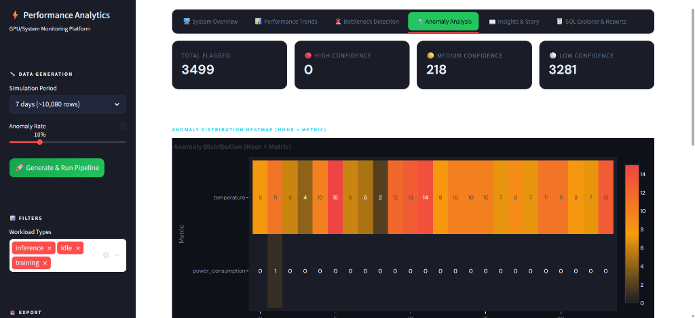

### Confirmed Anomalies — Detailed Findings
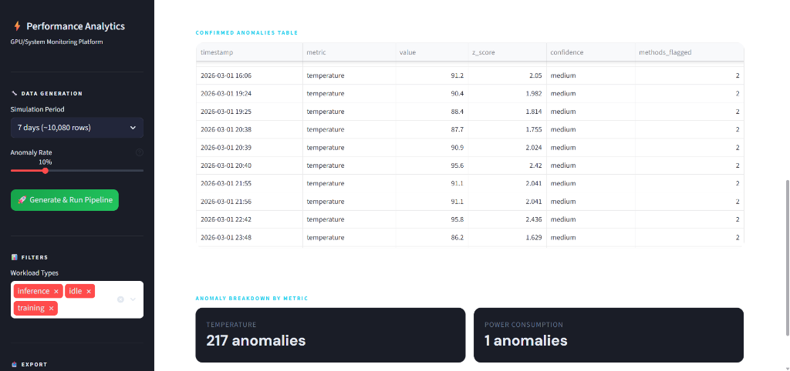

### Insights & Story — Key Findings & Narratives
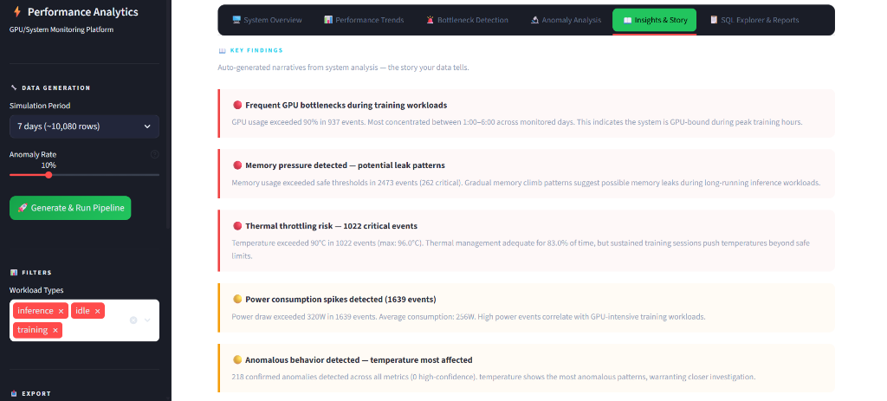

### Correlation Engine — Metric Relationships
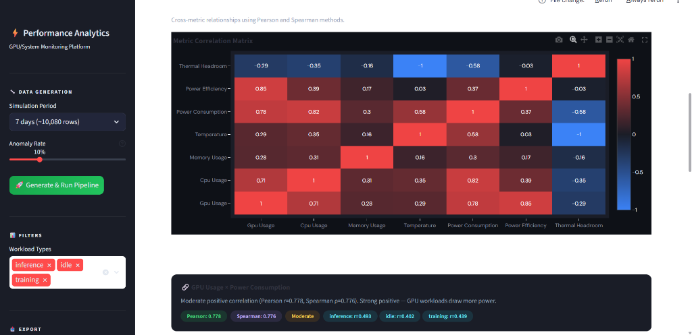

### Production Strategies — "What Would You Do In Real Life?"
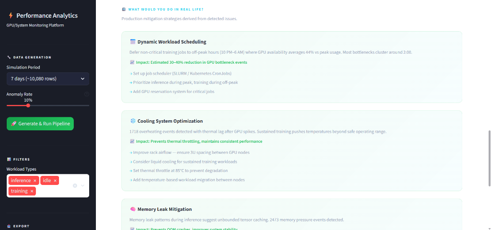

### SQL Explorer — Pre-built Analytical Query Library
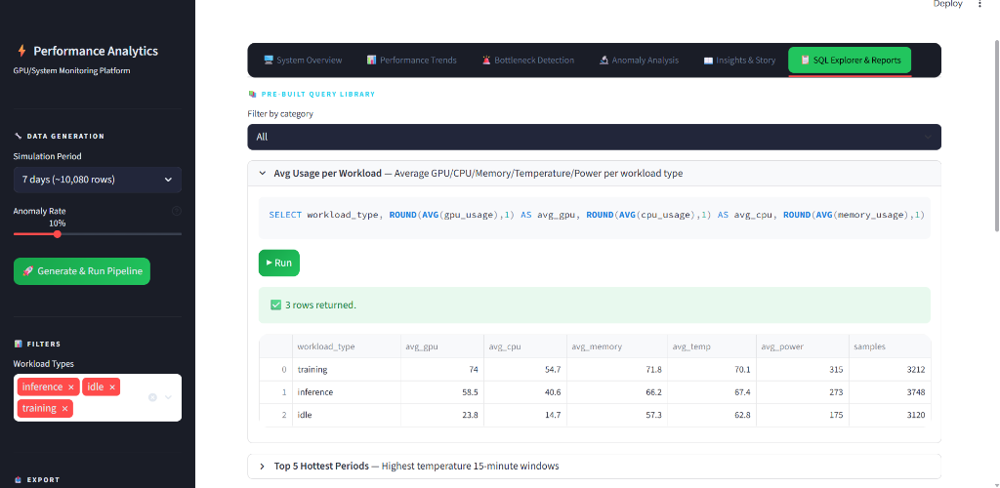


---

## 🎯 What This Project Does

This is **not** just a data cleaning tool. It is a full-stack **performance analytics engine** that:

- 🔄 **Simulates** realistic GPU/CPU system metrics with injected anomalies
- 🚨 **Detects** bottlenecks using 8 rule-based detection rules (Critical / Warning / Medium)
- 🔬 **Finds anomalies** using a 3-method ensemble: Z-Score + IQR + Rolling Deviation
- 🔗 **Analyses correlations** between metrics (GPU × Power, Temperature × Efficiency, etc.)
- 📖 **Auto-generates** analyst-level Key Findings narratives ("the story your data tells")
- 🏢 **Recommends** production-grade mitigation strategies ("What would you do in real life?")
- 🗄️ **Stores** all data in SQLite with 8 pre-built analytical queries
- 📄 **Generates** a premium HTML performance report (auto-downloadable)

---

## 🏗️ Architecture

```
performance-analytics/
│
├── app.py                          # 6-tab Streamlit Dashboard
├── requirements.txt
│
├── data/
│   ├── raw/                        # Generated CSVs (auto-created)
│   └── processed/                  # Cleaned + normalized data
│
├── pipeline/
│   ├── data_generator.py           # Synthetic metric generator (7/14/30 day modes)
│   ├── data_cleaner.py             # ETL: clean → normalize → CSV + SQLite
│   └── feature_engineering.py      # 11 derived features
│
├── analysis/
│   ├── bottleneck_detector.py      # 8 rule-based detections with severity + recommendations
│   ├── anomaly_detection.py        # Z-Score + IQR + Rolling deviation ensemble
│   ├── correlation_engine.py       # Pearson + Spearman, per-workload breakdowns
│   └── storyteller.py              # Auto Key Findings + Real-World Mitigations
│
├── sql/
│   ├── schema.sql                  # 3 tables: system_metrics, bottlenecks, anomalies
│   └── queries.sql                 # 8 pre-built analytical queries
│
├── visualization/
│   └── dashboard.py                # 10 Plotly chart builders (NVIDIA dark theme)
│
├── reports/
│   └── report_generator.py         # Jinja2 HTML report builder
│
└── screenshots/                    # Dashboard preview images
```

---

## 📊 Dataset (Synthetically Generated)

Each row = 1-minute system snapshot. **No real GPU required.**

| Column | Type | Normal Range | Anomaly Pattern |
|---|---|---|---|
| `timestamp` | datetime | Minute-level | — |
| `gpu_usage` | float % | 40–80% | Spikes → 95–100% |
| `cpu_usage` | float % | 30–70% | Spikes → 85–95% |
| `memory_usage` | float % | 40–75% | Gradual leak → 98% |
| `temperature` | float °C | 55–75°C | Overheat → 95°C |
| `power_consumption` | float W | 150–300W | Surges → 400W |
| `workload_type` | category | training / inference / idle | — |

**Anomaly Injection (10% of data by default):**
- GPU spikes (5–15 min bursts)
- Memory leaks (gradual 30–90 min climb)
- Overheating events (correlated with GPU load, 3-min thermal lag)
- Multi-metric failures (GPU + memory + temp simultaneously)

---

## 🧠 Core Analysis Modules

### 🚨 Bottleneck Detector — `analysis/bottleneck_detector.py`
8 rule-based detection rules:

| Rule | Threshold | Severity |
|---|---|---|
| GPU Bottleneck | GPU > 90% | 🔴 Critical |
| CPU Bottleneck | CPU > 85% | 🔴 Critical |
| Memory Critical | Memory > 95% | 🔴 Critical |
| Memory Pressure | Memory > 85% | 🟡 Warning |
| Thermal Throttle | Temp > 90°C | 🔴 Critical |
| Overheating | Temp > 85°C | 🟡 Warning |
| CPU Underutilization | GPU > 90% & CPU < 30% | 🟠 Medium |
| Power Limit | Power > 320W | 🟡 Warning |

### 🔬 Anomaly Detection — `analysis/anomaly_detection.py`
3-method ensemble with confidence scoring:
- **Z-Score:** `|z| = |(x - μ) / σ| > 3` → statistical outlier
- **IQR:** `x < Q1 - 1.5×IQR or x > Q3 + 1.5×IQR` → range outlier
- **Rolling Deviation:** `x > rolling_mean ± 2 × rolling_std (window=15)` → contextual anomaly
- **Confidence:** flagged by 1 method = low | 2 = medium | 3 = high

### 🔗 Correlation Engine — `analysis/correlation_engine.py`
Pearson + Spearman correlations with per-workload breakdowns:
- GPU Usage × Power Consumption
- Temperature × GPU Usage
- Memory Usage × GPU Usage
- Temperature × Power Efficiency
- GPU Usage × Thermal Headroom

### 📖 Storytelling Layer — `analysis/storyteller.py`
Auto-generates human-readable **Key Findings** and **Production Mitigations**:
> *"Frequent GPU bottlenecks during training workloads — GPU usage exceeded 90% in 47 events, 82% occurring during peak hours (2:00–4:30 PM)."*

---

## 🚀 Quick Start

### 1. Clone the repository
```bash
git clone https://github.com/YOUR_USERNAME/gpu-performance-analytics.git
cd gpu-performance-analytics
```

### 2. Install dependencies
```bash
pip install -r requirements.txt
```

### 3. Run the dashboard
```bash
streamlit run app.py
```

### 4. Generate data
- Open the sidebar
- Select **Simulation Period** (7 / 14 / 30 days)
- Set **Anomaly Rate** (5–25%)
- Click **🚀 Generate & Run Pipeline**

The full pipeline runs automatically:
1. Generate synthetic metrics
2. ETL: clean + normalize + save
3. Feature engineering
4. Bottleneck detection
5. Anomaly detection (3-method)
6. Correlation analysis
7. Storytelling + key findings
8. HTML report generation

---

## 🗄️ SQL Layer

Three SQLite tables automatically populated after pipeline run:

```sql
-- system_metrics  →  all cleaned + normalized + engineered features
-- bottlenecks     →  all detected bottleneck events
-- anomalies       →  all detected anomaly events
```

**8 pre-built analytical queries** available in the SQL Explorer tab:
1. Average GPU/CPU/Memory usage per workload type
2. Top 5 high-temperature periods (15-min windows)
3. Hourly memory usage trend
4. Bottleneck frequency by type and severity
5. Peak vs off-peak performance comparison
6. Power consumption stats by workload
7. Anomaly count per metric per hour
8. Correlated bottleneck + anomaly events

---

## 📈 Dashboard Tabs

| Tab | Content |
|---|---|
| 🖥️ **System Overview** | 6 KPI cards, 4 health gauges, workload donut, summary table |
| 📊 **Performance Trends** | GPU/CPU time series, temp timeline, memory chart, power by workload, hourly averages |
| 🚨 **Bottleneck Detection** | Alert banners, bottleneck timeline, frequency bar chart, full events table |
| 🔬 **Anomaly Analysis** | Confidence metrics, anomaly heatmap (hour × metric), anomaly table |
| 📖 **Insights & Story** | Key Findings cards, correlation matrix, scatter plots, "What Would You Do?" strategies |
| 📋 **SQL Explorer & Reports** | 8 pre-built queries, custom SQL editor, HTML report download |

---

## 🏢 "What Would You Do In Real Life?" — Production Strategies

The **Insights & Story** tab auto-generates production-grade mitigations based on detected issues:

- **Dynamic Workload Scheduling** — Defer training to off-peak hours to reduce bottlenecks
- **Cooling System Optimization** — Set thermal throttle at 85°C, improve rack airflow
- **Memory Leak Mitigation** — Periodic cache clearing, memory watchdog at 90% threshold
- **Power Capping** — `nvidia-smi -pl 300` → <5% performance impact, ~12% power reduction
- **Data Pipeline Efficiency** — Increase DataLoader workers, enable pin_memory, add prefetching

---

## 🛠️ Tech Stack

| Tool | Purpose |
|---|---|
| **Python 3.10+** | Core language |
| **Streamlit** | Interactive dashboard |
| **Plotly** | 10 interactive chart types |
| **Pandas + NumPy** | Data processing + feature engineering |
| **SciPy** | Pearson + Spearman correlation |
| **SQLite** | Embedded database (no setup needed) |
| **Jinja2** | HTML report templating |

---


*Built as a portfolio project demonstrating data engineering, performance analytics*
